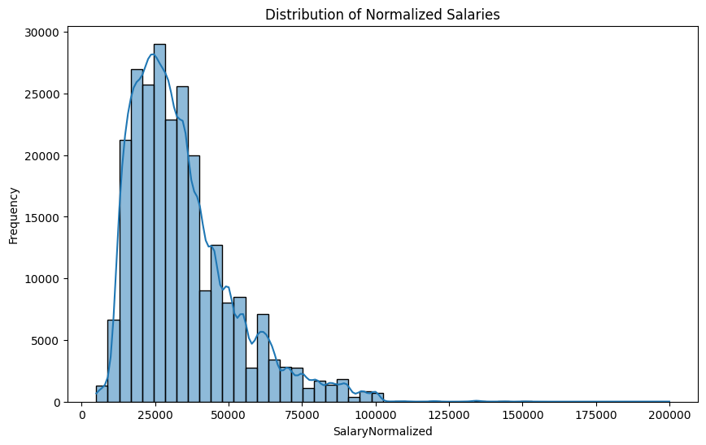
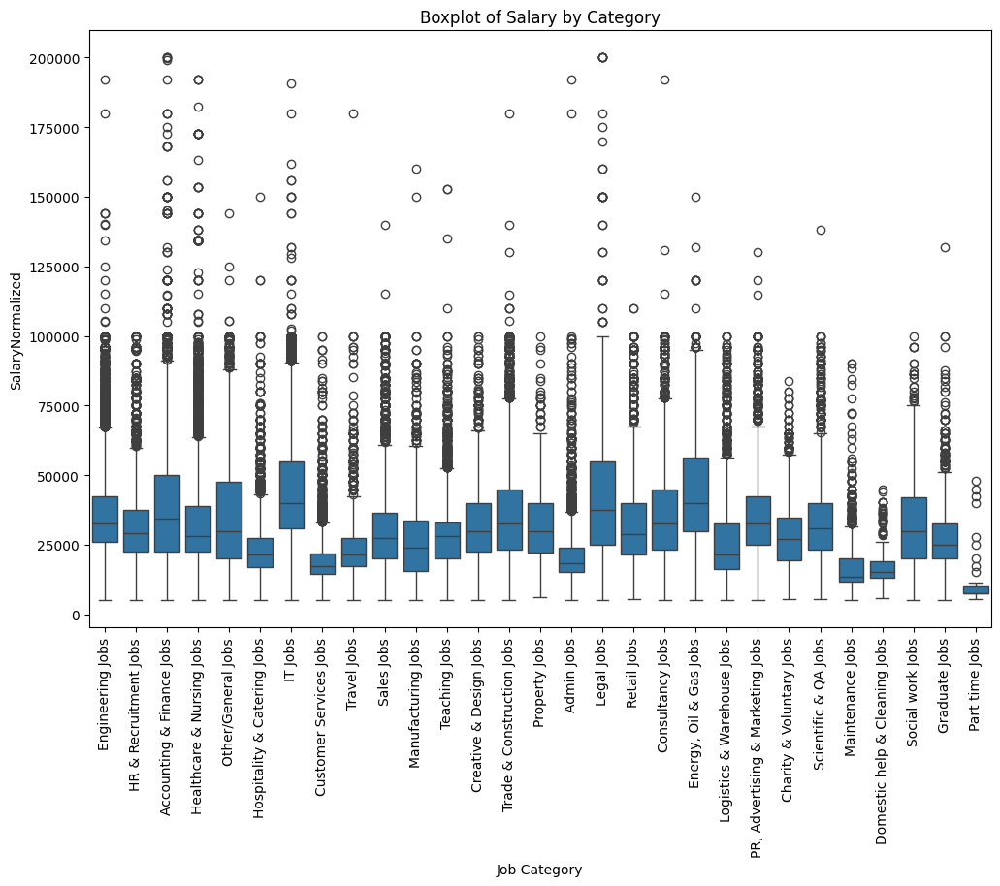

# **Project 2**

## **Exploratory Data Analysis (EDA)**

* **ID column** → Dropped (not useful for modeling)

* **Columns with missing values**:

  * `ContractType`: 73.26% missing
  * `ContractTime`: 26.11% missing
  * `Company`: 13.25% missing
  * `SourceName`: value in 1 row is missing

  ➔ Missing values were either filled with `"unknown"` or replaced with the most frequent value (mode), depending on the feature.

* **Unique values**: Counted for each column to understand cardinality:

* `Title`: 135,435 unique values
* `FullDescription`: 242,138 unique values
* `LocationRaw`: 20,986 unique values
* `LocationNormalized`: 2,732 unique values
* `ContractType`: 2 unique values
* `ContractTime`: 2 unique values
* `Company`: 20,812 unique values
* `Category`: 29 unique values
* `SalaryRaw`: 97,286 unique values
* `SalaryNormalized`: 8,454 unique values
* `SourceName`: 167 unique values

* **Duplicates**: No duplicate rows found.

* **Target variable distribution**:

  * `SalaryNormalized` histogram visualized with KDE.
  * Outliers inspected via boxplots grouped by job category.

  
  

---

## **Baseline Model** (Categorical Features Only)

**Features used:** `Category`, `Company`, `LocationNormalized`, `ContractType`, `ContractTime`

### **Preprocessing**

* Missing values filled with `"unknown"` or mode.
* **Encoding**:

  * **Low-cardinality** features (`Category`, `ContractType`, `ContractTime`) → One-hot encoding.
  * **High-cardinality** features (`Company`, `LocationNormalized`) → Target encoding 
* Feature and target scaling applied. Inverse transform used to recover real target values after training.
* **Data split:** 80% train / 10% validation / 10% test.

### **Model & Training**

* Implemented custom **PyTorch Dataset** and DataLoaders.
* Implemented **EarlyStopping** for regularization.
* Visualized training and validation loss curves.
* **Architecture:**

  * Simple feed-forward neural network with 2 hidden layers.
  * ReLU activations, Dropout regularization.
* **Training loop:**

  * Experimented with various hyperparameters: batch size, optimizer, learning rate scheduler, missing value strategies, number of neurons, etc.
* **Results:**

  * No significant improvement observed through hyperparameter tuning on the baseline.

---

## **Model with Text Features**

**Text features:** `Title`, `FullDescription`

### **Text Preprocessing**

* Lowercasing
* Removing HTML tags, emails, URLs
* Removing punctuation, special characters, and stop words
* Stemming or lemmatization

### **Feature Extraction**

* **TF–IDF** vectorization
* **Pre-trained word embeddings** (Sentence Transformers)

### **Implementation**

* **Custom pipeline classes**:

  * `TextPreprocessor`
  * `MinimalTextPreprocessor` (handles operations not covered by TF–IDF)
  * `TfidfTransformer`
* **Model training with text features**:

  * Added **Batch Normalization**, which reduced the gap between training and validation loss.
* **Using pre-trained embeddings**:

  * Sentence Transformer models: `all-MiniLM-L6-v2` and `all-MiniLM-L12-v2`
  * Computation time was significantly higher compared to TF–IDF.
* **Model architecture**:

  * Deeper network with an additional hidden layer.
  * Experimented with different ordering of BatchNorm and activation (BatchNorm → Activation worked best).
* **Multi-input model**:

  * Separate branches for text and categorical features.
  * Concatenated outputs passed through shared dense layers.
  * New Dataset class and training loop adapted for multi-input structure.

---

## **Final Steps & Experiments**

* Modularized the pipeline:

  * Data loading
  * Preprocessing
  * Model training
  * Evaluation
* Compared **TF–IDF vs pre-trained embeddings**:

  * TF–IDF achieved comparable performance with **significantly faster** preprocessing and training times.
* Experimented with:

  * Different batch sizes, optimizers, schedulers, number of neurons, architectures.
  * Dimensionality reduction using **SVD on TF–IDF** vectors.
  * Stop word removal strategies.
  * Various missing value filling approaches.

---

**Summary:**

* Established a strong baseline with categorical features.
* Enhanced performance and robustness by incorporating textual features.
* Explored both traditional TF–IDF and modern embedding techniques.
* Designed flexible, reusable PyTorch pipelines for multi-input models.
* Achieved efficient training with balanced model complexity and preprocessing time.

---

