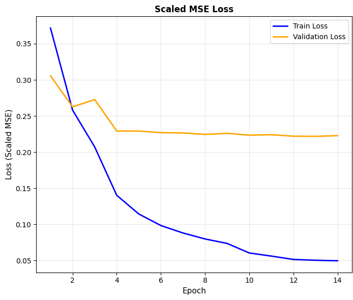

# Project Report: Job Salary Prediction with Neural Networks 

## 1. Introduction and Objectives
This report details the development and evaluation of neural network models designed to predict job salaries based on a combination of categorical and textual features. The dataset utilized originates from Kaggle's Job Salary Prediction competition. 
The main objectives of this project were to:
- Perform exploratory data analysis (EDA) to understand the dataset.
- Develop baseline and advanced neural network models incorporating both categorical and text-based features.
- Experiment with various text representation techniques, including TF-IDF and sentence embeddings.
- Optimize model performance through custom training loops, early stopping, and hyperparameter tuning.

## 2. Data Overview
The dataset comprises various features including job titles, full job descriptions, and categorical attributes such as location, contract type, and job category. Initial exploratory data analysis (EDA) was conducted to understand the data distribution, identify missing values, and visualize key relationships.

## 3. Modeling Approach
### 3.1 Baseline Model (Categorical Features Only)
A baseline feedforward neural network was constructed using only the categorical features. Preprocessing steps included filling missing values, encoding categorical variables, and scaling numerical features. A custom PyTorch dataset class was implemented to facilitate data loading. 

### 3.2 Text Integration
To enhance the model, textual features from job titles and full descriptions were incorporated. Some approaches were tried:
- **TF-IDF Vectorization**: Text data was vectorized using TF-IDF
- **Sentence Embeddings from Hugging Face**: Leveraged pre-trained Sentence Transformers to obtain dense vector representations of the text.
- **Self-Taught Models**: Explored architectures that learn text representations jointly with the main task.
- **Word2Vec**: Trained a custom Word2Vec model on the dataset to capture domain-specific semantics.
- **Readily Available Pretrained Models**: Utilized models like fastText for text representation.

### 3.3 Model Architectures
Multiple architectures were experimented with, including:
- Simple feedforward single input networks - `SimpleRegressor`
- Feedforward networks with Batch Normalization - `SimpleRegressorWithNormalization`
- Deeper feedforward networks with additional hidden layers and batch normalization - `IntegratedNN`
- Multi-input models combining categorical and text features - `MultiInputNN`
- Residual blocks to improve learning in deeper networks - `ResidualBlock`
- Model for self-taught learned embeddings during training - `SelfTaughtNN`
- Model with ready made frozen/unfrozen embedding matrix - `PreEncodedModel`
- Self-taught and unfrozen embedding matrix improved - residual connections/cnn/cnn+residual connections

## 4. Training and Evaluation
Models were trained using custom training loops with early stopping based on validation RMSE. Hyperparameter tuning was performed to optimize learning rates, batch sizes, and network architectures. The primary evaluation metric was MSE (RMSE for readability in original units).

## 5. Results overview

### 5.1 Categorical Models Performance
Baseline models using only categorical features achieved an RMSE of X on the validation set, serving as a benchmark for subsequent models.

**Baseline Categorical Model information - CategoricalModelv1:**
- Architecture: `SimpleRegressor` 
- Missing Value Handling: Imputation with `'unknown'` for categorical features
- Hyperparameters: `Learning Rate = 0.001`, `Batch Size = 32`, `Hidden Layers = [128, 64]`, `Dropout = 0.2`, `Optimizer = Adam`, `Loss Function = MSE`, `Early Stopping Patience = 3`
- Number of Trainable Parameters: 13185
- Training Time: 4.72 minutes (stopped by early stopping after 11 epochs)
- Training RMSE: 13213.59
- Validation RMSE: 13670.57
- Test RMSE: 13284.84
- Loss Curves: 
- 

#### 5.1.1 Hyperparameter Tuning Results
The hyperparameter tuning process revealed that for categorical data, changes in hyperparameters do not significantly affect model performance. Tried configurations included (hyperparameter that were not mentioned were kept as in the baseline model, expect for batch size which after training model number 3 was set to 64 to speed up training for the experiments):
- Not hyperparameter tuning, other approach for filling missing values - `'most frequent'` value - CategoricalModelv2
- Larger batch size - `64` - CategoricalModelv3
- Less neurons in hidden layers - `[64, 32]` - CategoricalModelv4
- `SGD` optimizer - CategoricalModelv5
- Enabling learning rate scheduler - CategoricalModelv6

The loss curves for these experiments are shown below:

- **Most Frequent Value Imputation**: 
- 
- **Larger Batch Size**: 
- 
- **Fewer Neurons**: 
- 
- **SGD Optimizer**: 
- 
- **Learning Rate Scheduler**: 
- 

Below you can see plots that compare Train, Validation and Test RMSE for all categorical models, their training times, number of parameters and overfitting levels.

- **RMSE Comparison:** 
- **Training Time Comparison:** 
- **Number of Parameters Comparison:** 
- **Overfitting Level Comparison:** 

As mentioned, hyperparameter tuning did not lead to significant improvements in performance for categorical models. The baseline model remained the best performer among the categorical-only models.

### 5.2 TF-IDF and Sentence Transformers Models Performance

To incorporate text data, at the start two strategies were deployed: TF-IDF and Sentence Transformers.

### 5.2.1 TF-IDF Models

I created class that transforms `FullDescription` and `Title` cols using TF-IDF with max 800 features for description and 50 for title. Text was cleaned and preprocessed (e.g., lowercasing, removing punctuation) by TF-IDF and also with custom function. The resulting sparse matrices were then converted to dense format and combined with categorical features for model training. Then baseline model was trained

**Baseline TF-IDF Model information - TfIdfModelv1:**
- Architecture: `SimpleRegressor` 
- Missing Value Handling: Imputation with `'unknown'` for categorical features
- Hyperparameters: `Learning Rate = 0.001`, `Batch Size = 64`, `Hidden Layers = [128, 64]`, `Dropout = 0.3`, `Optimizer = Adam`, `Loss Function = MSE`, `Early Stopping Patience = 3`
- Number of Trainable Parameters: 122113
- Training Time: 4.58 minutes (stopped by early stopping after 19 epochs)
- Training RMSE: 7835.60
- Validation RMSE: 9369.43
- Test RMSE: 9135.46
- Loss Curves: 
- 

After training with simple architecture I trained it by model with additional batch normalization to prevent overfitting and improve performance

**TF-IDF with Batch Normalization Model information - TfIdfModelv2:**
- Architecture: `SimpleRegressorWithNormalization`
- Missing Value Handling: Imputation with `'unknown'` for categorical features
- Hyperparameters: `Learning Rate = 0.001`, `Batch Size = 64`, `Hidden Layers = [128, 64]`, `Dropout = 0.3`, `Optimizer = Adam`, `Loss Function = MSE`, `Early Stopping Patience = 3`
- Number of Trainable Parameters: 122497
- Training Time: 4.44 minutes (stopped by early stopping after 14 epochs)
- Training RMSE: 9183.68
- Validation RMSE: 9594.86
- Test RMSE: 9296.22  
- Loss Curves: 
- 

Batch normalization successfully reduced overfitting and achieved similar performance.
The next tried TF-IDF model was deeper network with additional hidden layer and batch normalization

**Deeper TF-IDF Model with Batch Normalization - TfIdfModelv3:**
- Architecture: `IntegratedNN`
- Missing Value Handling: Imputation with `'unknown'` for categorical features
- Hyperparameters: `Learning Rate = 0.001`, `Batch Size = 64`, `Hidden Layers = [256, 128, 64]`, `Dropout = 0.3`, `Optimizer = Adam`, `Loss Function = MSE`, `Early Stopping Patience = 3`
- Number of Trainable Parameters: 269697
- Training Time: 7.29 minutes (stopped by early stopping after 18 epochs)
- Training RMSE: 8858.86
- Validation RMSE: 99220.58
- Test RMSE: 9090.37
- Loss Curves: 
- 

I also tried to pass TF-IDF text features through separate input branch in multi-input model.

**TF-IDF Multi-Input Model - TfIdfModelv4:**
- Architecture: `MultiInputNN`
- Missing Value Handling: Imputation with `'unknown'` for categorical features
- Hyperparameters: `Learning Rate = 0.001`, `Batch Size = 64`, `Embedding Hidden Layers = [256, 128]`, `Tabular Hidden = [64, 32]`, `Combined Hidden = [128, 64]`, `dropout = 0.3`, `Optimizer = Adam`, `Loss Function = MSE`, `Early Stopping Patience = 3`
- Number of Trainable Parameters: 129697
- Training Time: 6.43 minutes (stopped by early stopping after 11 epochs)
- Training RMSE: 10011.56
- Validation RMSE: 9989.09	
- Test RMSE: 9782.22
- Loss Curves: 
- 

After these experiments I performed hyperparameter tuning and other techniques for TF-IDF using `IntegratedNN` architecture. Below you can find tried approaches and loss curves for each of them

- filling missing values with most frequent value instead of `'unknown'` - TfIdfModelv5
- 
- Simpler model with smaller hidden size - `SimpleRegressorWithNormalization` with `[64, 32]` neurons - TfIdfModelv6
- 
- `IntegratedNN` with less neurons - TfIdfModelv7
- 
- Using learning rate scheduler - TfIdfModelv8
- 
- Using `SGD` optimizer - TfIdfModelv9
- 
- Adding SVD for dimensionality reduction - TfIdfModelv10
- 
- Removing stop words in text features - TfIdfModelv11
- 

As an additional experiment I also trained TF-IDF models for predicting log of the salary instead scaling target using approach and architecture from TfIdfModelv11 - TfIdfModelLog.
The loss curves for these experiments are shown below:

#### Comparison of TF-IDF Models

The plots below summarize performance, training time, number of parameters and overfitting levels for all TF-IDF models developed during this project.
- **RMSE Comparison:** 
- **Training Time Comparison:** 
- **Number of Parameters Comparison:** 
- **Overfitting Level Comparison:** 

We can see that the best performing TF-IDF model was Model 11 - `IntegratedNN` with stop words removing. We can also notice that Model 4 and Model 9 may need longer training as validation loss is smaller than training loss.

### 5.2.2 Sentence Transformers Models

For sentence transformers models I used pretrained model from Hugging Face - `all-MiniLM-L12-v2` to generate sentence embeddings for `FullDescription` and `Title` columns. I tried to pass these embeddings through separate input branch in multi-input model and also concatenate them with categorical features as single input.

As a baseline I trained `SimpleRegressor` model with concatenated categorical and sentence embeddings features.

**Baseline Sentence Transformers Model information - EmbeddingModelv1:**
- Architecture: `SimpleRegressor` 
- Missing Value Handling: Imputation with `'unknown'` for categorical features
- Hyperparameters: `Learning Rate = 0.001`, `Batch Size = 64`, `Hidden Layers = [128, 64]`, `Dropout = 0.2`, `Optimizer = Adam`, `Loss Function = MSE`, `Early Stopping Patience = 3`
- Number of Trainable Parameters: 111617
- Training Time: 2.58 minutes (stopped by early stopping after 11 epochs)
- Training RMSE: 9309.08		
- Validation RMSE: 9643.54
- Test RMSE: 9384.85
- Loss Curves: 
- 

Next I trained model with batch normalization - `SimpleRegressorWithNormalization`

**Sentence Transformers with Batch Normalization Model information - EmbeddingModelv2:**
- Architecture: `SimpleRegressorWithNormalization`
- Missing Value Handling: Imputation with `'unknown'` for categorical features
- Hyperparameters: `Learning Rate = 0.001`, `Batch Size = 64`, `Hidden Layers = [128, 64]`, `Dropout = 0.2`, `Optimizer = Adam`, `Loss Function = MSE`, `Early Stopping Patience = 3`
- Number of Trainable Parameters: 112001
- Training Time: 6.56 minutes (stopped by early stopping after 20 epochs)
- Training RMSE: 9092.38
- Validation RMSE: 9366.19
- Test RMSE: 9176.47
- Loss Curves: 
- 

Then I trained `IntegratedNN` model with sentence embeddings and categorical features as single input.

**Deeper Sentence Transformers Model with Batch Normalization - EmbeddingModelv3:**
- Architecture: `IntegratedNN`
- Missing Value Handling: Imputation with `'unknown'` for categorical features
- Hyperparameters: `Learning Rate = 0.001`, `Batch Size = 64`, `Hidden Layers = [256, 128, 64]`, `Dropout = 0.3`, `Optimizer = Adam`, `Loss Function = MSE`, `Early Stopping Patience = 3`
- Number of Trainable Parameters: 248705
- Training Time: 5.58 minutes (stopped by early stopping after 14 epochs)
- Training RMSE: 8986.65
- Validation RMSE: 9271.01
- Test RMSE: 9051.86
- Loss Curves: 
- 

As an experiment I tried to put batch normalization after Relu activation in `IntegratedNN` architecture instead of before it.

**Sentence Transformers IntegratedNN with BatchNorm after Relu - EmbeddingModelv4:**
- Architecture: `IntegratedNN` with BatchNorm after Relu
- Missing Value Handling: Imputation with `'unknown'` for categorical features
- Hyperparameters: `Learning Rate = 0.001`, `Batch Size = 64`, `Hidden Layers = [256, 128, 64]`, `Dropout = 0.3`, `Optimizer = Adam`, `Loss Function = MSE`, `Early Stopping Patience = 3`
- Number of Trainable Parameters: 248705
- Training Time: 2.91 minutes (stopped by early stopping after 8 epochs)
- Training RMSE: 10163.93
- Validation RMSE: 9905.69
- Test RMSE: 10694.22
- Loss Curves: 
- 

Finally I trained `MultiInputNN` model with separate input branch for sentence embeddings and categorical features.

**Sentence Transformers Multi-Input Model - EmbeddingModelv5:**
- Architecture: `MultiInputNN`
- Missing Value Handling: Imputation with `'unknown'` for categorical features
- Hyperparameters: `Learning Rate = 0.001`, `Batch Size = 64`, `Embedding Hidden Layers = [256, 128]`, `Tabular Hidden = [64, 32]`, `Combined Hidden = [128, 64]`, `dropout = 0.3`, `Optimizer = Adam`, `Loss Function = MSE`, `Early Stopping Patience = 3`
- Number of Trainable Parameters: 264609	
- Training Time: 10.79 minutes (stopped by early stopping after 18 epochs)
- Training RMSE: 8858.86
- Validation RMSE: 9220.58
- Test RMSE: 9075.089844
- Loss Curves: 
- 

#### Comparison of Sentence Transformers Models

The plots below summarize performance, training time, number of parameters and overfitting levels for all Sentence Transformers models developed during this project.
- **RMSE Comparison:** 
- **Training Time Comparison:** 
- **Number of Parameters Comparison:** 
- **Overfitting Level Comparison:** 

The best model among sentence transformers was EmbeddingModelv3 - `IntegratedNN` with classic batch normalization before Relu activation.
The model with inverted batch normalization (EmbeddingModelv4) showed that after some epochs valid loss becomes much larger than training loss which may indicate that this approach is not effective in this case.

### 5.3 Self-Taught, Word2Vec, and Pretrained Embeddings Models Performance

#### 5.3.1 Self-Taught Models

The next approach was to tokenize text data using simple manual splitting tokens and allow model to learn embeddings from scratch during training. I created custom functions that tokenize text data, build vocabulary. Then I trained `SelfTaughtNN` which has a `nn.Embedding` layer that learns embeddings during training.

**Baseline Self-Taught Embeddings Model information - Model 1:**
- Architecture: `SelfTaughtNN`
- Missing Value Handling: Imputation with `'unknown'` for categorical features
- Hyperparameters: `Learning Rate = 0.001`, `Batch Size = 64`, `Embedding Size = 256`, `min_freq=20` (minimum frequency for token inclusion), `Regressor Hidden Layers = [256, 128]`, `Categorical Hidden Layer = 128`, `Dropout = 0.3`, `Optimizer = Adam`, `Loss Function = MSE`, `Early Stopping Patience = 3`, `Scheduler = Yes`, `Scheduler patience = 1`, `factor=0.5`
- Number of Trainable Parameters: 6006913	
- Training Time: 12.08 minutes (stopped by early stopping after 13 epochs)
- Training RMSE: 7408.83
- Validation RMSE: 9057.16
- Test RMSE: 8755.20
- Loss Curves: 
- 

#### 5.3.2 Word2Vec Embeddings Models

For Word2Vec I experimented with 3 different approaches:
1. Training Word2Vec model (skip-gram for each approach) on our dataset to transform text data into embeddings and pass them through `PreEncodedModel` architecture which doesn't have embedding layer.

2. Training Word2Vec model on our dataset to build embedding matrix for our vocabulary and use it in the model as a frozen embedding layer.

3. Training Word2Vec model on our dataset to build embedding matrix for our vocabulary and use it in the model as a trainable embedding layer.

**Word2Vec with embeddings as input information - Model 1:**
- Architecture: `PreEncodedModel`
- Missing Value Handling: Imputation with `'unknown'` for categorical features
- Hyperparameters: `Learning Rate = 0.001`, `Batch Size = 64`, `min_freq=20` (minimum frequency for token inclusion), `Embedding Size = 256`, `Regressor Hidden Layers = [256, 128]`, `Categorical Hidden Layer = 128`, `Dropout = 0.3`, `Optimizer = Adam`, `Loss Function = MSE`, `Early Stopping Patience = 3`, `Scheduler = Yes`, `Scheduler patience = 1`, `factor=0.5`
- Number of Trainable Parameters: 137601
- Training Time: 11.76 minutes (full 30 epochs)
- Training RMSE: 9004.66
- Validation RMSE: 9321.83	
- Test RMSE: 9075.20
- Loss Curve: 
- 

**Word2Vec with frozen embedding layer information - Model 2:**
- Architecture: `EmbeddingMatrixNN` with frozen embeddings
- Missing Value Handling: Imputation with `'unknown'` for categorical features
- Hyperparameters: `Learning Rate = 0.001`, `Batch Size = 64`, `min_freq=20` (minimum frequency for token inclusion), `Embedding Size = 256`, `Regressor Hidden Layers = [256, 128]`, `Categorical Hidden Layer = 128`, `Dropout = 0.3`, `Optimizer = Adam`, `Loss Function = MSE`, `Early Stopping Patience = 3`, `Scheduler = Yes`, `Scheduler patience = 1`, `factor=0.5`
- Number of Trainable Parameters: 137601
- Training Time: 13.99 minutes (full 30 epochs)
- Training RMSE: 9055.38
- Validation RMSE: 9365.70
- Test RMSE: 9081.429688
- Loss Curve: 
-  

**Word2Vec with trainable embedding layer information - Model 3:**

- Architecture: `EmbeddingMatrixNN` with trainable embeddings
- Missing Value Handling: Imputation with `'unknown'` for categorical features
- Hyperparameters: `Learning Rate = 0.001`, `Batch Size = 64`, `min_freq=20` (minimum frequency for token inclusion), `Embedding Size = 256`, `Regressor Hidden Layers = [256, 128]`, `Categorical Hidden Layer = 128`, `Dropout = 0.3`, `Optimizer = Adam`, `Loss Function = MSE`, `Early Stopping Patience = 3`, `Scheduler = Yes`, `Scheduler patience = 1`, `factor=0.5`
- Number of Trainable Parameters: 6006913
- Training Time: 13.87 minutes (stopped by early stopping after 15 epochs)
- Training RMSE: 6401.42
- Validation RMSE: 8879.48
- Test RMSE: 8518.16
- Loss Curve: 
- 

From the plots we can see that the model with unfrozen embedding layer performed the best among Word2Vec approaches, but is most prone to overfitting.

#### 5.3.3 Pretrained Embeddings Models

For pretrained embeddings I used fastText model - `fasttext-wiki-news-subwords-300` to build embedding matrix for our vocabulary and use it in the same way as Word2Vec approaches - transforming tokens into embeddings and using them in both frozen and trainable embedding layers.

**Pretrained Embeddings as input information - Model 1:**
- Architecture: `PreEncodedModel`
- Missing Value Handling: Imputation with `'unknown'` for categorical features
- Hyperparameters: `Learning Rate = 0.001`, `Batch Size = 64`, `Embedding Size = 300`, `Regressor Hidden Layers = [256, 128]`, `Categorical Hidden Layer = 128`, `Dropout = 0.3`, `Optimizer = Adam`, `Loss Function = MSE`, `Early Stopping Patience = 3`, `Scheduler = Yes`, `Scheduler patience = 1`, `factor=0.5`
- Number of Trainable Parameters: 148865
- Training Time: 6.73 minutes (stopped by early stopping after 17 epochs)
- Training RMSE: 10655.36	
- Validation RMSE: 10561.75
- Test RMSE: 10300.469727
- Loss Curve: 
- 

**Pretrained Embeddings with frozen embedding layer information - Model 2:**

- Architecture: `EmbeddingMatrixNN` with frozen embeddings
- Missing Value Handling: Imputation with `'unknown'` for categorical features
- Hyperparameters: `Learning Rate = 0.001`, `Batch Size = 64`, `Embedding Size = 300`, `Regressor Hidden Layers = [256, 128]`, `Categorical Hidden Layer = 128`, `Dropout = 0.3`, `Optimizer = Adam`, `Loss Function = MSE`, `Early Stopping Patience = 3`, `Scheduler = Yes`, `Scheduler patience = 1`, `factor=0.5`
- Number of Trainable Parameters: 148865
- Training Time: 14.80 minutes (stopped by early stopping after 30 epochs)
- Training RMSE: 10769.90	
- Validation RMSE: 10680.629883
- Test RMSE: 10680.629883
- Loss Curve: 
- 

**Pretrained Embeddings with trainable embedding layer information - Model 3:**

- Architecture: `EmbeddingMatrixNN` with trainable embeddings
- Missing Value Handling: Imputation with `'unknown'` for categorical features
- Hyperparameters: `Learning Rate = 0.001`, `Batch Size = 64`, `Embedding Size = 300`, `Regressor Hidden Layers = [256, 128]`, `Categorical Hidden Layer = 128`, `Dropout = 0.3`, `Optimizer = Adam`, `Loss Function = MSE`, `Early Stopping Patience = 3`, `Scheduler = Yes`, `Scheduler patience = 1`, `factor=0.5`
- Number of Trainable Parameters: 7026965
- Training Time: 11.01 minutes (stopped by early stopping after 11 epochs)
- Training RMSE: 7823.59	
- Validation RMSE: 9178.29
- Test RMSE: 8877.240234
- Loss Curve: 
- 

Again model with trainable embedding layer performed the best among Pretrained Embeddings approaches, but is most prone to overfitting. However it didn't outperform Word2Vec with trainable embeddings.

### 5.3.4 Hyperparameter Tuning for Self-Taught model

To experiment with hyperparameter tuning for Self-Taught model I tried the following approaches and architectures:

- initial cleaning - removing stop words - `SelfTaughtModelv2`
    - 

- higher embedding size - `300` - `SelfTaughtModelv3`
    - 

- smaller embedding size - `128` - `SelfTaughtModelv4`
    - 

- larger vocabulary - `min_freq=15` - `SelfTaughtModelv5`
    - 

- shorter max sequence length - `250` - `SelfTaughtModelv6`
    - 

From the plots we can see that increasing embedding size to 300 improved performance. Other approaches did not lead to significant improvements.

#### 5.3.4 Mitigation of Overfitting for Self-Taught models with Trainable Embeddings

All the models that learn embeddings during training or modify already learned embeddings showed signs of overfitting. To mitigate this, I experimented with `SelfTaughtNN` architecture by:

- increasing dropout rate from `0.3` to `0.45` - `SelfTaughtModelOverfittingMitigationv1`
    - 

- decreasing number of neurons in hidden layers: categorical hidden from `128` to `64` and regressor hidden from `[256, 128]` to `[128, 64]` - `SelfTaughtModelOverfittingMitigationv2`
    - 

- Starting with larger learning rate = `0.01` and using learning rate scheduler to reduce it by factor `0.1` each time (`patience=0`) - `SelfTaughtModelOverfittingMitigationv3`
    - 

- increasing vocabulary size by decreasing `min_freq` from `20` to `10` - `SelfTaughtModelOverfittingMitigationv4`
    - 

- early stopping with `patience = 2`, `dropout = 0.4`, `min_freq = 10`, `lr_scheduler_patience = 0`, `scheduler_factor = 0.25`, `lr = 0.005` - `SelfTaughtModelOverfittingMitigationv5`
    - 

- early stopping with `patience = 2`, `dropout = 0.35`, `min_freq = 20`, `lr_scheduler_patience = 0`, `scheduler_factor = 0.5`, `lr = 0.003` - `SelfTaughtModelOverfittingMitigationv6`
    - 

This investigation shows that it is very challenging to mitigate overfitting and keep the validation RMSE low.

#### 5.3.5 Comparison of Self-Taught, Word2Vec and Pretrained Embeddings Models

The plots below summarize performance, training time, number of parameters and overfitting levels for all Self-Taught, Word2Vec and Pretrained Embeddings including SelfTaught hyperparameter tuning and overfitting mitigation models.

- **RMSE Comparison:** 
- **Training Time Comparison:** 
- **Number of Parameters Comparison:** 
- **Overfitting Level Comparison:** 

### 5.5 New more Complex Architectures for Self-Taught, Word2Vec and Pretrained Embeddings

To further improve performance, I experimented with more complex architectures for the best performing approaches from previous section - `SelfTaughtNN` with trainable embeddings, Word2Vec with trainable embeddings and Pretrained Embeddings with trainable embeddings. I added residual connections, convolutional layers and combination of both to these models. For each of these models I set the same hyperparameters:
- `Learning Rate = 0.001`, `Batch Size = 64`, `Embedding Size = 300`, `Regressor Hidden Layers = [256, 128]`, `Categorical Hidden Layer = 128`, `Dropout = 0.3`, `Optimizer = Adam`, `Loss Function = MSE`, `Early Stopping Patience = 2`, `Scheduler = Yes`, `Scheduler patience = 0`, `factor=0.5`

The following architectures were tried:

- `SelfTaughtNN` with Residual Connections - `ResidualSelfTaughtModelv1`
    - 

- `SelfTaughtNN` with Convolutional Layers - `CNNSelfTaughtModelv1`
    - 

- `SelfTaughtNN` with Convolutional Layers and Residual Connections - `CNNResidualSelfTaughtModelv1`
    - 

- Word2Vec with Residual Connections - `ResidualWord2VecModelv1`
    - 

- Word2Vec with Convolutional Layers - `CNNWord2VecModelv1`
    - 

- Word2Vec with Convolutional Layers and Residual Connections - `CNNResidualWord2VecModelv1`
    - 

- FastText Pretrained Embeddings with Residual Connections - `ResidualFastTextModelv1`
    - 

- FastText Pretrained Embeddings with Convolutional Layers - `CNNFastTextModelv1`
    - 

- FastText Pretrained Embeddings with Convolutional Layers and Residual Connections - `CNNResidualFastTextModelv1`
    - 

**Comparison of New Complex Architectures**

The plots below summarize performance, training time, number of parameters and overfitting levels for new complex architectures.
- **RMSE Comparison:** 
- **Training Time Comparison:** 
- **Number of Parameters Comparison:** 
- **Overfitting Level Comparison:** 

We can see that these models are more complex and have larger number of parameters which leads to longer training times. However some of them achieved better performance compared to simpler architectures. The best performing model among these was `CNNResidualSelfTaughtModelv1`.

### 5.6 Comparative Analysis

The plots below summarize performance, training time, number of parameters and overfitting levels for the best 10 models developed during this project.
- **RMSE Comparison:** 
- **Training Time Comparison:** 
- **Number of Parameters Comparison:** 
- **Overfitting Level Comparison:** 

## 6. Conclusions

* The best approach for text representation was using Word2Vec, training it on our dataset, building an embedding matrix for our vocabulary and using it in the model as a trainable embedding layer. This approach allowed the model to learn domain-specific semantics, leading to improved performance compared to using generic pretrained embeddings or simpler methods like TF-IDF.

* Simple manual splitting tokens and allowing model to learn embeddings from scratch also performed really well. It outperformed sophisticated pretrained models from Hugging Face like Sentence Transformers. This suggests that for this specific task, domain-specific learned embeddings were more effective than general-purpose pretrained models.

* The model that achieved the best performance was CNNResidualSelfTaughtModelv1 - model with convolutional layers and residual connections, with a Test RMSE of 7973.2. However, it exhibited signs of overfitting, as indicated by the gap between training and validation RMSE which was 3052.9. Moreover, the training time for this model was 34.8 minutes, which is quite long. Least but not least, the model had 6.184.961 trainable parameters, making it quite complex.

* If we prioritize training time, SelfTaughtModelOverfittingMitigationv6 stand out. SelfTaughtModelOverfittingMitigation has a Test RMSE of 8609, with a training time of 10 minutes but still has 6006913 trainable parameters.

* If we can't afford a lot of training parameters we should go for tf-idf model with stop words removal which had only 269697 trainable parameters, training time of 9.32 minutes and test RMSE of 8758.74. 

* Overall, the experiments highlighted the importance of tailored text representation techniques and careful model architecture selection in achieving optimal performance for job salary prediction tasks. For only categorical features the baseline achieved the test RMSE of 13284.84, while as mentioned earlier best models with text features achieved 7973.2 test RMSE. It is significant improvement showing the value of incorporating textual data in the prediction task.

## 7. Appendix - Summary Table of All Models

| Model Type                             | Full Model Name                                                             |   Parameters |   Training Time (min) |   Time per Epoch (s) |   Epochs |   Best Epoch |   Train RMSE |   Valid RMSE |   Test RMSE |
|:---------------------------------------|:----------------------------------------------------------------------------|-------------:|----------------------:|---------------------:|---------:|-------------:|-------------:|-------------:|------------:|
| CNNResidualWord2vecModelv1             | word2vec_e256_mlen320_mf20_cnn_res_unfroz_tok_chid64_rhid128_dr30_es_2      |      6184961 |                 34.78 |               189.71 |       11 |            9 |      5156.61 |      8209.49 |     7973.18 |
| CNNWord2vecModelv1                     | word2vec_e256_mlen320_mf20_cnn_unfroz_tok_chid64_rhid128_dr30_es_2          |      6007105 |                 35.75 |               178.75 |       12 |           10 |      5867.47 |      8274.66 |     8025.1  |
| CNNResidualFasttextModelv1             | fasttext_e300_mlen320_mf20_cnn_res_unfroz_tok_chid64_rhid128_dr30_es_2      |      7202197 |                 43.22 |               185.21 |       14 |           12 |      3960.91 |      8309.1  |     8092.77 |
| CNNResidualSelfTaughtModelv1           | selftaught_e300_mlen320_mf20_cnn_res_learn_chid64_rhid128_dr30_es_2         |      7221461 |                 43.36 |               173.45 |       15 |           13 |      6150.07 |      8362.97 |     8226.89 |
| CNNFasttextModelv1                     | fasttext_e300_mlen320_mf20_cnn_unfroz_tok_chid64_rhid128_dr30_es_2          |      7024341 |                 27.62 |               165.71 |       10 |            8 |      5602.41 |      8555.85 |     8311.88 |
| CNNSelfTaughtModelv1                   | selftaught_e300_mlen320_mf20_cnn_learn_chid64_rhid128_dr30_es_2             |      7024341 |                 43.7  |               174.81 |       15 |           13 |      7114.9  |      8693.72 |     8434.77 |
| Word2vecModelv3                        | word2vec_e256_mlen320_mf20_base_unfroz_tok_chid128_rhid256_dr30_lrs         |      6006913 |                 13.87 |                55.48 |       15 |           12 |      6401.42 |      8879.48 |     8518.16 |
| SelfTaughtModelOverfittingMitigationv6 | selftaught_e256_mlen320_mf20_base_learn_chid64_rhid128_dr35_lr_0003_es_2    |      6006913 |                 10.04 |                54.76 |       11 |            9 |      7441.7  |      8917.52 |     8608.96 |
| SelfTaughtModelv3                      | selftaught_e300_mlen320_mf20_base_learn_chid128_rhid256_dr30_lrs            |      7026965 |                 18.89 |                59.65 |       19 |           16 |      6699.15 |      8966.3  |     8656.93 |
| ResidualFasttextModelv1                | fasttext_e300_mlen320_mf20_res_unfroz_tok_chid64_rhid128_dr30_es_2          |      7252757 |                 15.92 |                86.83 |       11 |            9 |      6215.43 |      8971.63 |     8687.39 |
| SelfTaughtModelOverfittingMitigationv4 | selftaught_e256_mlen320_mf10_base_learn_chid64_rhid128_dr30                 |      8797313 |                 15.88 |                56.05 |       17 |           14 |      7449.21 |      8989.41 |     8746.75 |
| SelfTaughtModelv1                      | selftaught_e256_mlen320_mf20_base_learn_chid128_rhid256_dr30_lrs            |      6006913 |                 12.08 |                55.74 |       13 |           10 |      7408.83 |      9057.16 |     8755.21 |
| TfIdfModelv11                          | tfidf_stopwords_800_50_int_unk_bs64_adam_lrs_no_hid256_dr30                 |       269697 |                  9.32 |                22.36 |       25 |           23 |      7506.8  |      9011.95 |     8758.74 |
| SelfTaughtModelOverfittingMitigationv3 | selftaught_e256_mlen320_mf20_base_learn_chid64_rhid128_dr30_lrs_01_0_lr_001 |      6006913 |                 10.2  |                55.64 |       11 |            8 |      7531.22 |      8989.5  |     8759.54 |
| SelfTaughtModelv6                      | selftaught_e256_mlen250_mf20_base_learn_chid128_rhid256_dr30_lrs            |      6006913 |                 16.44 |                70.46 |       14 |           11 |      7332.43 |      9096.32 |     8781.68 |
| SelfTaughtModelOverfittingMitigationv5 | selftaught_e256_mlen320_mf10_base_learn_chid64_rhid128_dr40_lr_0005_es_2    |      6006913 |                  7.62 |                57.15 |        8 |            6 |      7766.96 |      9104.1  |     8783.26 |
| ResidualSelfTaughtModelv1              | selftaught_e300_mlen320_mf20_base_res_learn_chid64_rhid128_dr30_lrs_es_2    |      7252757 |                 27.77 |               151.46 |       11 |            9 |      6769.92 |      8969.91 |     8791.27 |
| SelfTaughtModelv4                      | selftaught_e128_mlen320_mf20_base_learn_chid128_rhid256_dr30_lrs            |      3039489 |                 12.21 |                40.7  |       18 |           15 |      7754.64 |      9185.17 |     8849.59 |
| SelfTaughtModelOverfittingMitigationv1 | selftaught_e300_mlen320_mf20_base_learn_chid128_rhid256_dr45_lrs            |      6006913 |                 13.71 |                54.84 |       15 |           12 |      7802.23 |      9135.86 |     8872.3  |
| FastTextModelv3                        | fasttext_e300_mlen320_mf20_base_unfroz_tok_chid128_rhid256_dr30_lrs         |      7026965 |                 11.01 |                60.05 |       11 |            8 |      7823.59 |      9178.29 |     8877.24 |
| SelfTaughtModelOverfittingMitigationv2 | selftaught_e256_mlen320_mf20_base_learn_chid64_rhid128_dr30_lrs             |      5921729 |                 12.03 |                55.52 |       13 |           10 |      7788.82 |      9120.57 |     8878.78 |
| SelfTaughtModelv5                      | selftaught_e300_mlen320_mf15_base_learn_chid128_rhid256_dr30_lrs            |      3530497 |                 11.1  |                41.63 |       16 |           13 |      8011.45 |      9096.99 |     8895.04 |
| SelfTaughtModelv2                      | selftaught_e256_mlen320_mf20_base_learn_chid128_rhid256_dr30_lrs_cleaned    |      5768321 |                 25.64 |               139.85 |       11 |            8 |      7625    |      9093.72 |     8911.64 |
| TfIdfModelv8                           | tfidf_800_50_int_unk_bs64_adam_lrs_hid256_dr30                              |       269697 |                  7.51 |                22.53 |       20 |           17 |      7629.15 |      9200.09 |     8919.75 |
| ResidualWord2vecModelv1                | word2vec_e256_mlen320_mf20_base_res_unfroz_tok_chid64_rhid128_dr30_es_2     |      7252757 |                 12.41 |               124.07 |        6 |            4 |      7936.14 |      9184.12 |     8953.62 |
| TfIdfModelLog                          | tfidf_stopwords_800_50_int_unk_bs64_adam_lrs_hid256_dr30_logy               |       269697 |                  8.2  |                22.36 |       22 |           19 |      9255.97 |      9307.95 |     9037.42 |
| EmbeddingModelv3                       | emb_int_unk_bs64_adam_lrs_no_hid256_dr30                                    |       248705 |                  5.58 |                23.91 |       14 |           11 |      8986.65 |      9271.01 |     9051.86 |
| TfIdfModelv6                           | tfidf_800_50_int_mf_bs64_adam_lrs_no_hid256_dr30                            |        59201 |                  4.3  |                14.32 |       18 |           15 |      8858.86 |      9220.58 |     9063.54 |
| TfIdfModelv5                           | tfidf_800_50_int_mf_bs64_adam_lrs_no_hid256_dr30                            |       269697 |                  6.05 |                21.36 |       17 |           14 |      8291.18 |      9301.71 |     9063.54 |
| EmbeddingModelv5                       | emb_multi_unk_bs64_adam_lrs_no_hid256_dr30                                  |       264609 |                 10.79 |                35.97 |       18 |           15 |      8858.86 |      9220.58 |     9075.09 |
| Word2vecModelv1                        | word2vec_e256_mlen320_mf20_base_pass_emb_chid128_rhid256_dr30_lrs           |       137601 |                 11.76 |                23.53 |       30 |           30 |      9004.66 |      9321.83 |     9075.21 |
| Word2vecModelv2                        | word2vec_e256_mlen320_mf20_base_froz_tok_chid128_rhid256_dr30_lrs           |       137601 |                 13.99 |                27.98 |       30 |           30 |      9055.38 |      9365.7  |     9081.43 |
| TfIdfModelv3                           | tfidf_800_50_int_unk_bs64_adam_lrs_no_hid256_dr30                           |       269697 |                  7.29 |                24.3  |       18 |           15 |      8858.86 |      9220.58 |     9090.37 |
| TfIdfModelv1                           | tfidf_800_50_sr_unk_bs64_adam_lrs_no_hid128_dr30                            |       122113 |                  4.58 |                14.46 |       19 |           16 |      7835.6  |      9369.43 |     9135.46 |
| EmbeddingModelv2                       | emb_srbn_unk_bs64_adam_lrs_no_hid128_dr30                                   |       112001 |                  6.56 |                19.69 |       20 |           17 |      9092.38 |      9366.19 |     9176.47 |
| TfIdfModelv2                           | tfidf_800_50_srbn_unk_bs64_adam_lrs_no_hid128_dr30                          |       122497 |                  4.44 |                19.03 |       14 |           11 |      9183.68 |      9594.86 |     9296.22 |
| TfIdfModelv7                           | tfidf_800_50_int_unk_bs64_adam_lrs_no_hid128_dr30                           |       124609 |                  6.61 |                22.03 |       18 |           15 |      9058.73 |      9504.25 |     9330.28 |
| EmbeddingModelv1                       | emb_sr_unk_bs64_adam_lrs_no_hid128_dr30                                     |       111617 |                  2.58 |                14.06 |       11 |            8 |      9309.08 |      9643.54 |     9384.85 |
| TfIdfModelv4                           | tfidf_800_50_multi_unk_bs64_adam_lrs_no_hid256_dr30                         |       129697 |                  6.43 |                35.05 |       11 |            8 |     10011.6  |      9989.09 |     9782.22 |
| TfIdfModelv9                           | tfidf_800_50_int_unk_bs64_sgd_lrs_no_hid256_dr30                            |       269697 |                  5.63 |                16.89 |       20 |           17 |     10283    |     10125    |     9910.86 |
| TfIdfModelv10                          | tfidf_svd_200_10_int_unk_bs64_adam_lrs_no_hid256_dr30                       |       105857 |                  5.48 |                21.9  |       15 |           12 |      9957.73 |     10052.4  |     9978.58 |
| FastTextModelv1                        | fasttext_e300_mlen320_mf20_base_pass_emb_chid128_rhid256_dr30_lrs           |       148865 |                  6.73 |                23.75 |       17 |           14 |     10655.4  |     10561.8  |    10300.5  |
| FastTextModelv2                        | fasttext_e300_mlen320_mf20_base_froz_tok_chid128_rhid256_dr30_lrs           |       148865 |                 14.8  |                29.6  |       30 |           30 |     10769.9  |     11018.7  |    10680.6  |
| EmbeddingModelv4                       | emb_int_unk_bs64_adam_lrs_no_hid256_dr30_batchnorm_after                    |       248705 |                  2.91 |                21.83 |        8 |            5 |     10163.9  |      9905.69 |    10694.2  |
| CategoricalModelv1                     | cat_unk_bs32_adam_lrs_no_hid128_dr20                                        |        13185 |                  4.72 |                25.75 |       11 |            9 |     13213.6  |     13670.6  |    13284.8  |
| CategoricalModelv3                     | cat_unk_bs64_adam_lrs_no_hid128_dr20                                        |        13185 |                  1.53 |                13.15 |        7 |            4 |     13219.9  |     13664.7  |    13300.2  |
| CategoricalModelv6                     | cat_unk_bs64_adam_lrs_hid128_dr20                                           |        13185 |                  1.09 |                13.13 |        5 |            2 |     13256    |     13706.7  |    13311.9  |
| CategoricalModelv4                     | cat_unk_bs64_adam_lrs_no_hid64_dr20                                         |         4545 |                  1.74 |                13.02 |        8 |            5 |     13329.6  |     13694.8  |    13322.3  |
| CategoricalModelv5                     | cat_unk_bs64_sgd_lrs_no_hid128_dr20                                         |        13185 |                  1.5  |                 9.97 |        9 |            6 |     13301    |     13696.7  |    13366.9  |
| CategoricalModelv2                     | cat_mf_bs32_adam_lrs_no_hid128_dr20                                         |        12929 |                  2.54 |                25.37 |        6 |            3 |     13447.1  |     13843.1  |    13512.2  |
